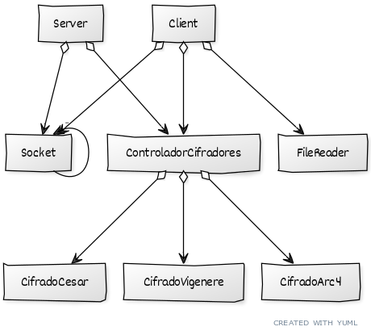

# Trabajo Práctico 1 - Taller de Programación - Crypto Sockets

Alumno: Robinson Fang

Padrón: 97009

Corrector: Leonardo Ballera

Repositorio: https://github.com/fangrobinson/taller-de-programacion-1-veiga-tp1-crypto-sockets

La tarea consistía en desarrollar dos programas: uno emisor (o cliente), y otro receptor (o servidor) de un mensaje cifrado.

El programa emisor lee mensajes por entrada estándar y los envía cifrados, mientras que el receptor debe descifrarlos y mostrarlos por salida estándar.

## 20 Oct _ Estado del trabajo en la primera entrega:

Se desarrollaron los 3 cifradores cada uno en una tda correctamente encapsulada. El uso de estos debe ser mediante acceso a un Controlador de Cifradores que se encarga de inicializar y utilizar el cifrador que corresponde para cada ejecución de cliente y servidor.

Se identificó un error en vigenere que itera la clave para cifrar(descifrar) desde la posición 0 cada vez que recibe un nuevo buffer, en lugar de continuar desde la última posición utilizada en el cifrado.

Así mismo también se implementó un tda tanto para el cliente como para el servidor. Ninguno de estos se encarga del parseo de la entrada estándar utilizada para instanciarlos e invocarlos. 

También se desarrolló un socket tda, incapaz de mandar o recibir mensajes. Por lo que la incapacidad de cumplir las funciones mínimas pedidas se radica en esto.

## 01 Nov _ Cambios Primera Re-entrega:

Fueron arregladas todas las definiciones de tipos para ser consistentes y más claros en los módulos.

Fueron removidos todos los mallocs innecesarios.

Ahora mismo quedaron 2:  
- para la reserva dinámica de la struct cifradora que depende del parámetro de método ingresado por línea de comando.
- uno para el buffer en la clase servidor y cliente.

El problema con _2_ es que al ser el buffer de largo dinámico su tamaño se decide en tiempo de ejecución, por lo que alocarlo en el stack está desrecomendado por cppcheck. Se prefirió usar malloc en lugar de hardcodear en módulos mencionados el largo a utilizar (en el alcance de este trabajo práctico es 64 bytes), porque se decidió que no es responsabilidad de estos definir el largo del buffer. Se definieron en server_main.c y client_main.c por si el día de mañana cambia el valor a ser usado.

Vigenere tenía únicamente el problema que señalado con anterioridad y en rc4 descifrar se removió el reinit que antes era utilizado para chequeos internos en etapa de depuración. 

Los _main.c de ambos cliente y servidor fueron depurados sumando código de a poco y tratando primero de mandar un mensaje simple.

Los problemas encontrados en el tipo de dato abstracto socket estaban relacionados a los valores de devolución y al bucle que se encargaba de enviar/recibir. 

## Solución propuesta:

El diagrama muestra la relación que existe entre las estructuras y sus funciones en la solución propuesta.

La estructura y relación entre los módulos no fue modificada, por lo que el diagrama hecho con anterioridad sigue reflejando el trabajo entregado en esta ocasión.

Se creó un tda para cada entidad del problema, siendo estas:

- Servidor
- Cliente
- Socket
- FileReader
- ControladorCifradores
- CifradoCesar
- CifradoVigenere
- CifradoArc4

#### Servidor y Cliente
Se encargan de manejar el envío y la recepción del mensaje por medio del uso de Socket como así también su cifrado/descifrado por medio de un ControladorCifradores.
En el caso del Cliente este además está relacionado con un FileReader que se encarga de leer de entrada estándar.
#### Socket
Modelan la entidad socket que permite utilizar los métodos que provee el sistema para el envío y recepción de mensajes.
#### FileReader
Se encarga de leer de entrada estándar y se realizó de forma tal que su extensión para leer de un archivo sea sencilla.
#### ControladorCifradores
La responsabilidad principal del ControladorCifradores es alocar e inicializar el cifrador que se utilizará. No interviene en el cifrado/descrifado, sino que lo delega en el cifrador correspondiente a cada ejecución.
#### CifradoCesar/Vigenere/Arc4
Modelan el cifrado/descifrado de un mensaje de forma tal que puedan alocarse, inicializarse y utilizarse de la misma forma mientras que las particularidades de las tareas de traducción se tratan de manera opaca para los usuarios.

Todas las pruebas corren satisfactoriamente y se han realizado los checkeos correspondientes con cpplint, cppcheck y valgrind. 